# Comprehensive Design Document

## 🧵 Original Requirement

Create a web application for tic tac toe game.

## 🧵 Product Owner's Review

APPROVED

## 🧵 User Stories

### 🧵 User Story 1: Game Board Display

#### 🔹 Functional Specifications

* The grid should display 9 squares (3x3).
* Each square should be clickable.
* The squares should be reset to empty state when the game starts.

#### 🔧 Technical Specifications

* The game board will be implemented using HTML and CSS.
* The clickable squares will be created using JavaScript.
* The game will use a 2D array to represent the game board.

#### 🏗 Architecture Diagrams

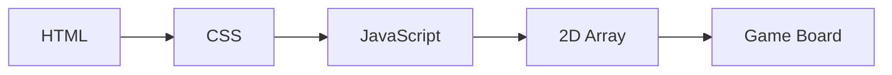

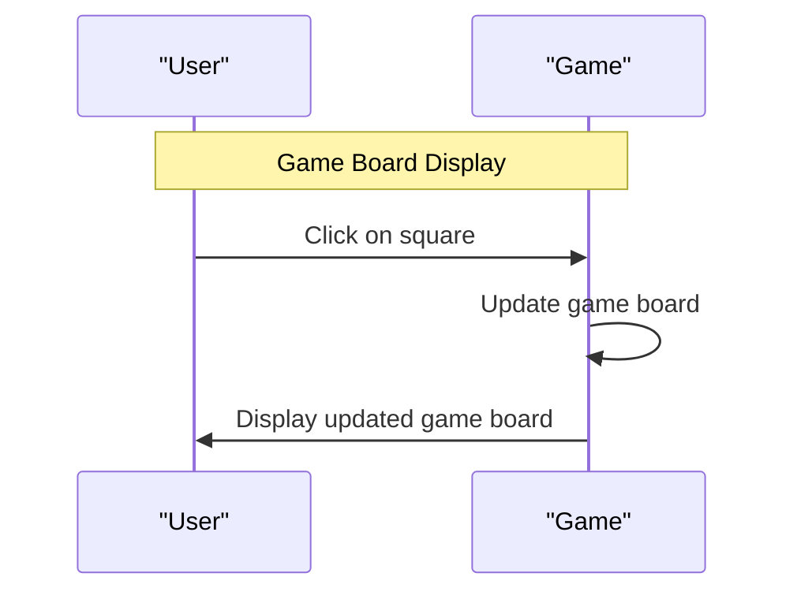

### 🧵 User Story 2: Player Input

#### 🔹 Functional Specifications

* The user can click on an empty square to place their symbol.
* The symbol should be displayed on the clicked square.
* The user should not be able to place a symbol on a square that is already occupied.

#### 🔧 Technical Specifications

* The player input will be handled using JavaScript.
* The game will use a variable to keep track of the current player's symbol.
* The game will use a 2D array to represent the game board and check for occupied squares.

#### 🏗 Architecture Diagrams

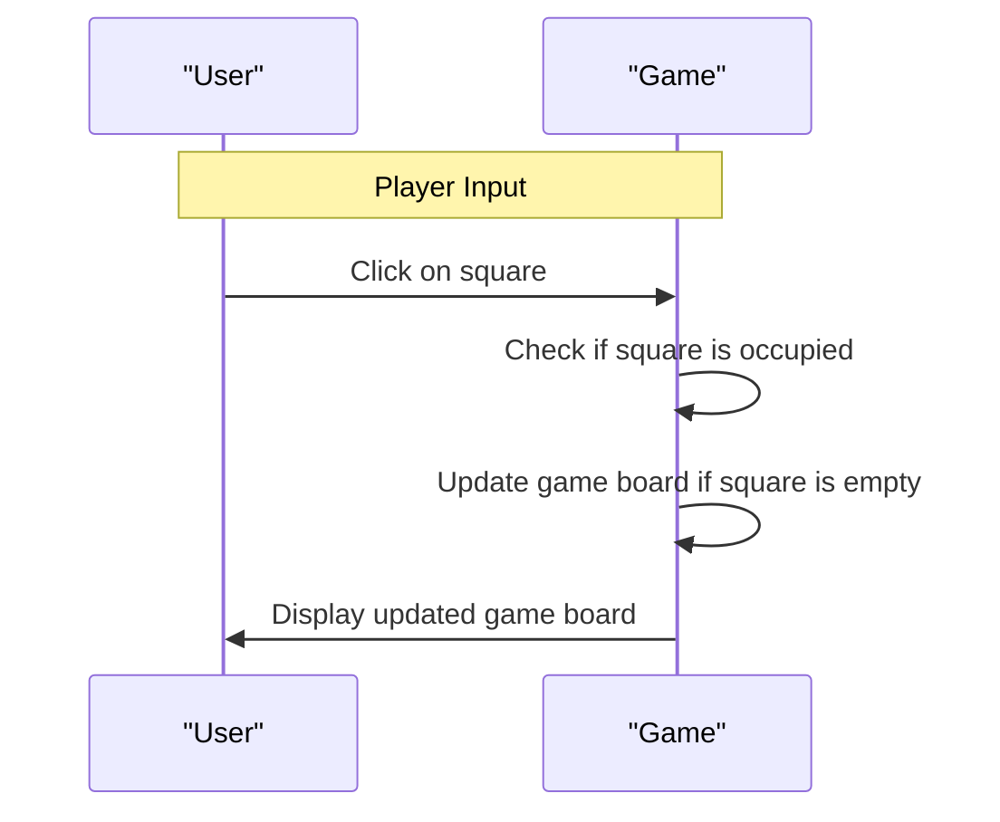

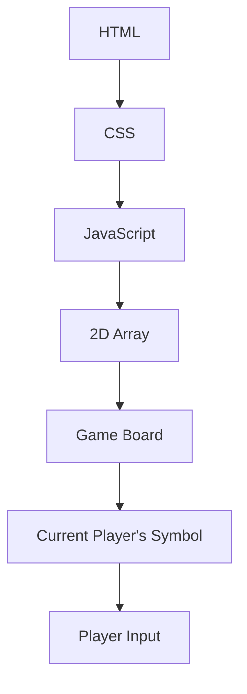

### 🧵 User Story 3: Game Logic

#### 🔹 Functional Specifications

* The game should check for a winner after each move.
* The game should check for a draw when all squares are occupied.
* The game should declare a winner (X or O) and display the message when a player wins.

#### 🔧 Technical Specifications

* The game logic will be implemented using JavaScript.
* The game will use a variable to keep track of the winner.
* The game will use a function to check for a winner and a draw.

#### 🏗 Architecture Diagrams

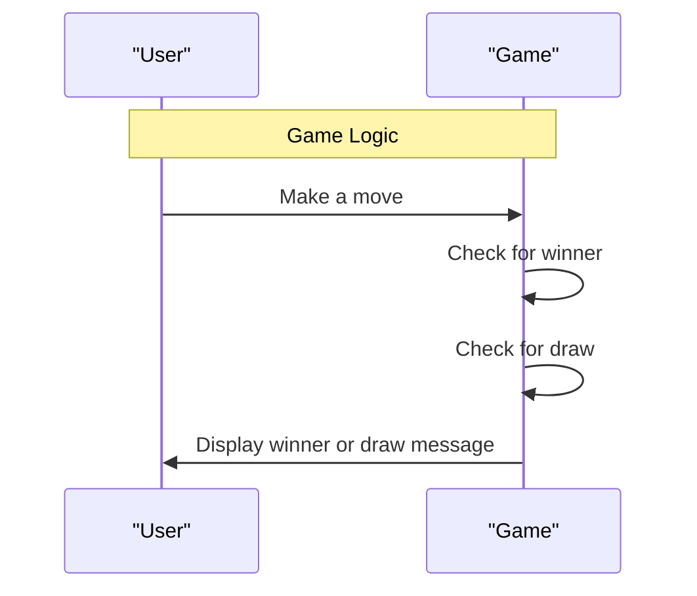

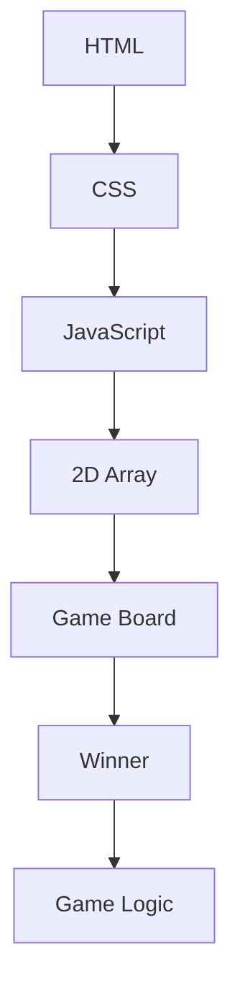

### 🧵 User Story 4: Reversal of Symbol

#### 🔹 Functional Specifications

* The symbols should alternate after each move (e.g., X then O, then X again, etc.).
* The game should display the correct symbol for the current player.

#### 🔧 Technical Specifications

* The reversal of symbol will be implemented using JavaScript.
* The game will use a variable to keep track of the current player's symbol.
* The game will update the symbol after each move.

#### 🏗 Architecture Diagrams

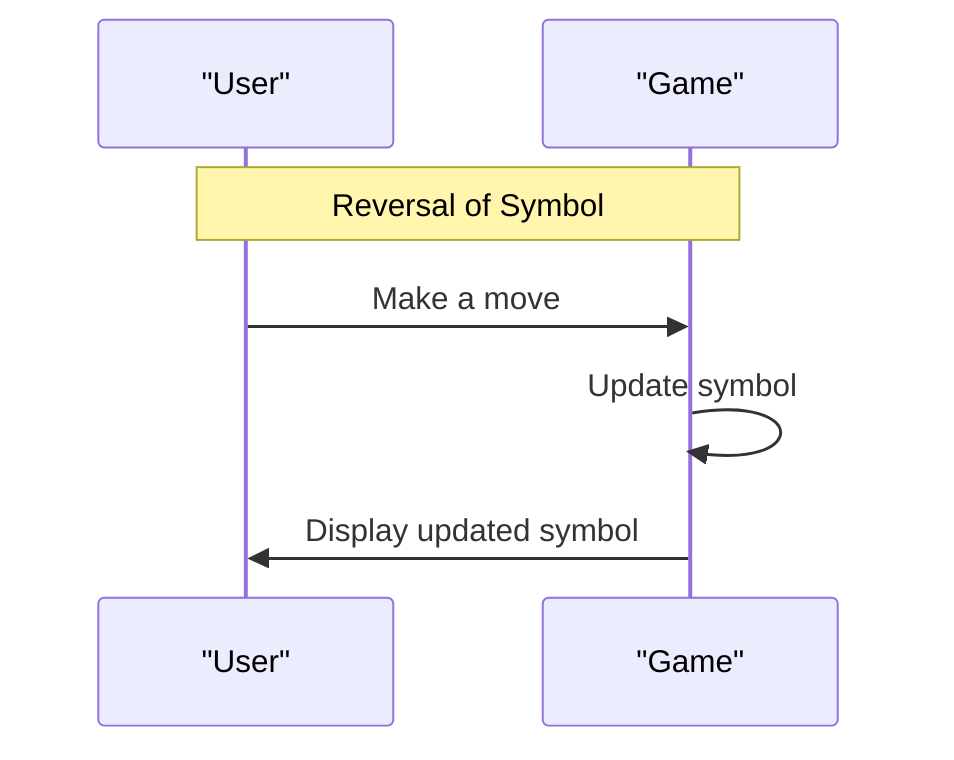

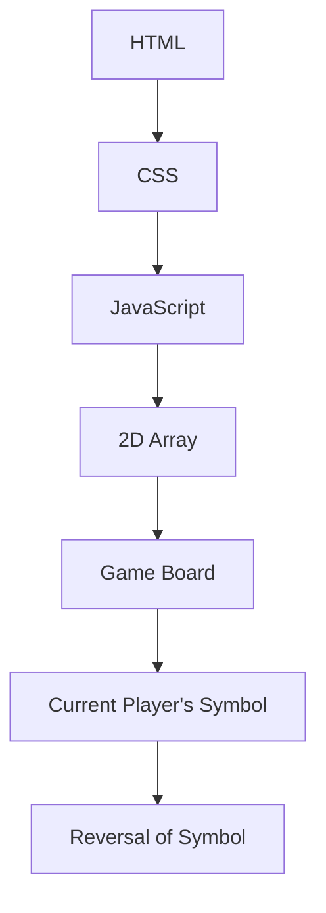

### 🧵 User Story 5: Reset Game

#### 🔹 Functional Specifications

* The game should reset the board to the initial state when the reset button is clicked.
* The game should display a message to confirm the reset.

#### 🔧 Technical Specifications

* The reset game will be implemented using JavaScript.
* The game will use a function to reset the game board.
* The game will display a message to confirm the reset.

#### 🏗 Architecture Diagrams

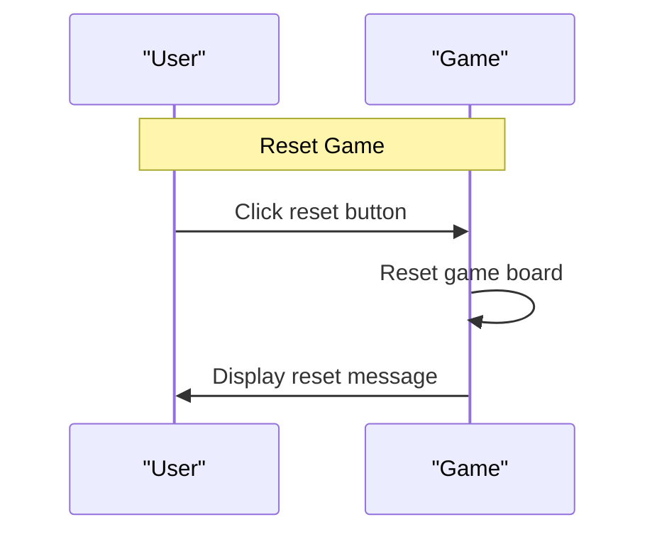

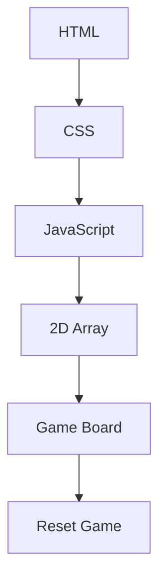

### 🧵 User Story 6: Validations

#### 🔹 Functional Specifications

* The game should prevent a user from clicking on an occupied square.
* The game should prevent a user from clicking on a square that is not within the grid boundaries.
* The game should handle invalid input (e.g., non-clickable elements).

#### 🔧 Technical Specifications

* The validations will be implemented using JavaScript.
* The game will use a function to check for occupied squares and invalid input.
* The game will prevent the user from making a move if the input is invalid.

#### 🏗 Architecture Diagrams

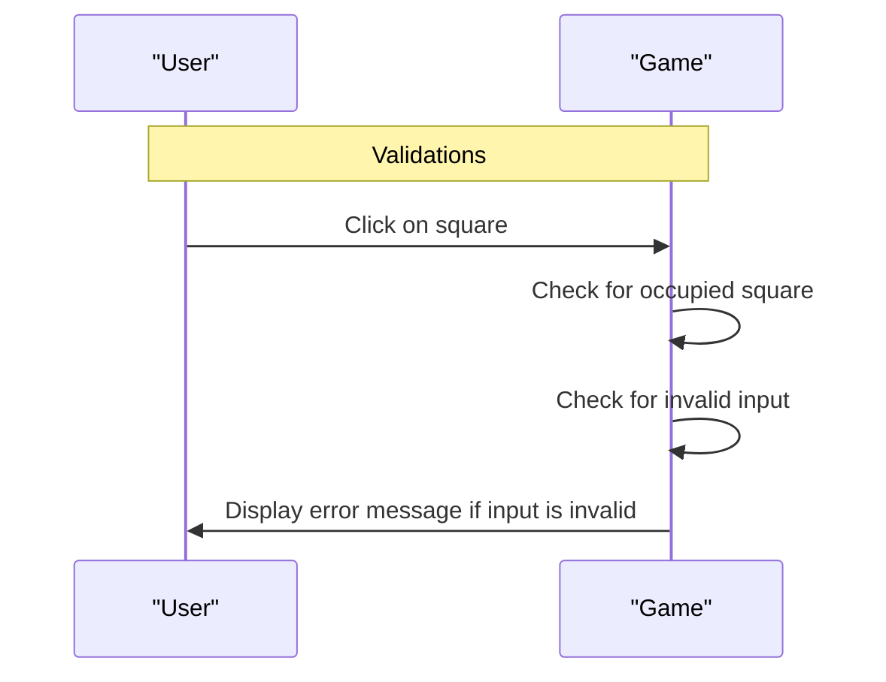

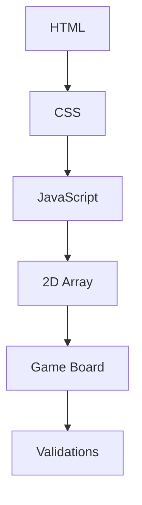

### 🧵 User Story 7: Accessibility

#### 🔹 Functional Specifications

* The game should be compatible with various browsers and devices.
* The game should be easy to navigate and understand.
* The game should follow accessibility guidelines (e.g., color contrast, font size).

#### 🔧 Technical Specifications

* The accessibility features will be implemented using HTML, CSS, and JavaScript.
* The game will use semantic HTML to ensure accessibility.
* The game will use CSS to ensure color contrast and font size.

#### 🏗 Architecture Diagrams

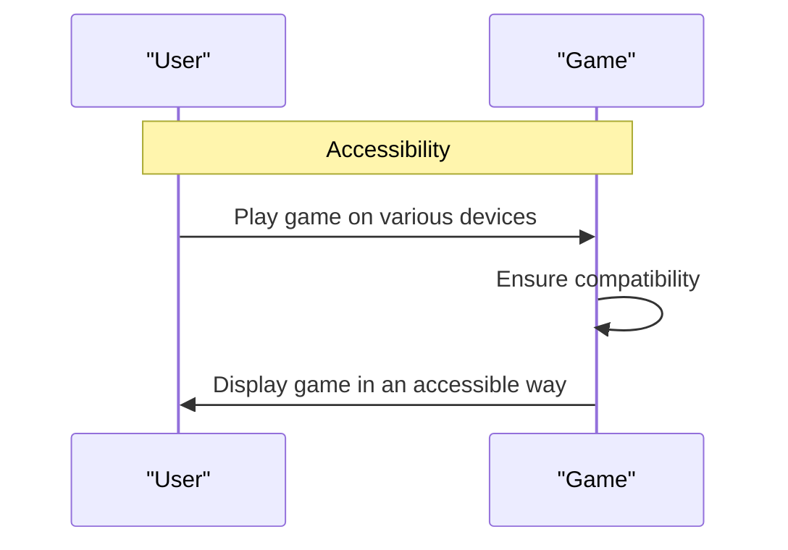

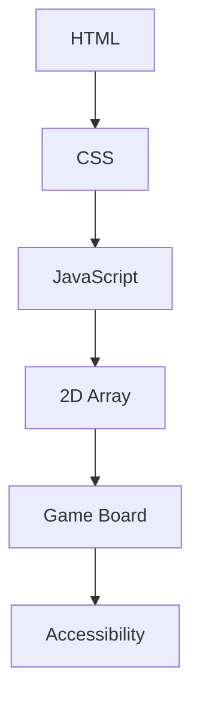

### 🧵 User Story 8: Error Handling

#### 🔹 Functional Specifications

* The game should handle unexpected errors and exceptions.
* The game should display a clear error message to the user.
* The game should recover from errors and continue running smoothly.

#### 🔧 Technical Specifications

* The error handling will be implemented using JavaScript.
* The game will use a try-catch block to catch errors and exceptions.
* The game will display a clear error message to the user.

#### 🏗 Architecture Diagrams

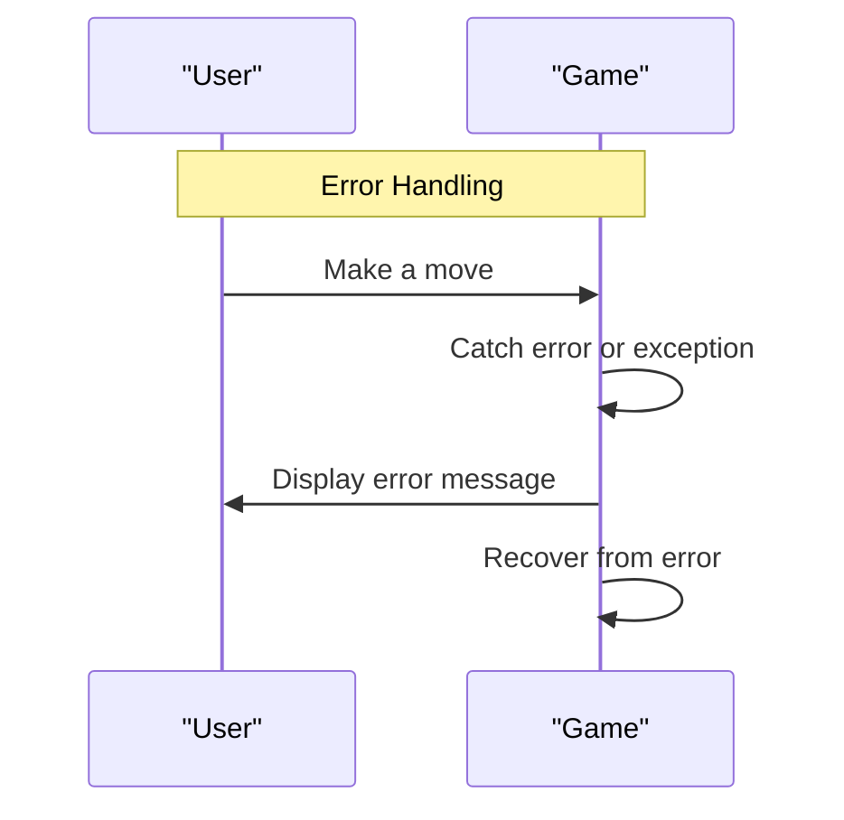

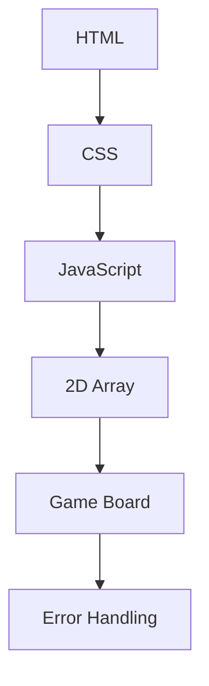

### 🧵 Conclusion

The comprehensive design document outlines the functional and technical specifications for the Tic Tac Toe game. The game will be implemented using HTML, CSS, and JavaScript, and will include features such as game board display, player input, game logic, reversal of symbol, reset game, validations, accessibility, and error handling. The game will be compatible with various browsers and devices, and will follow accessibility guidelines. The game will handle unexpected errors and exceptions, and will display a clear error message to the user.